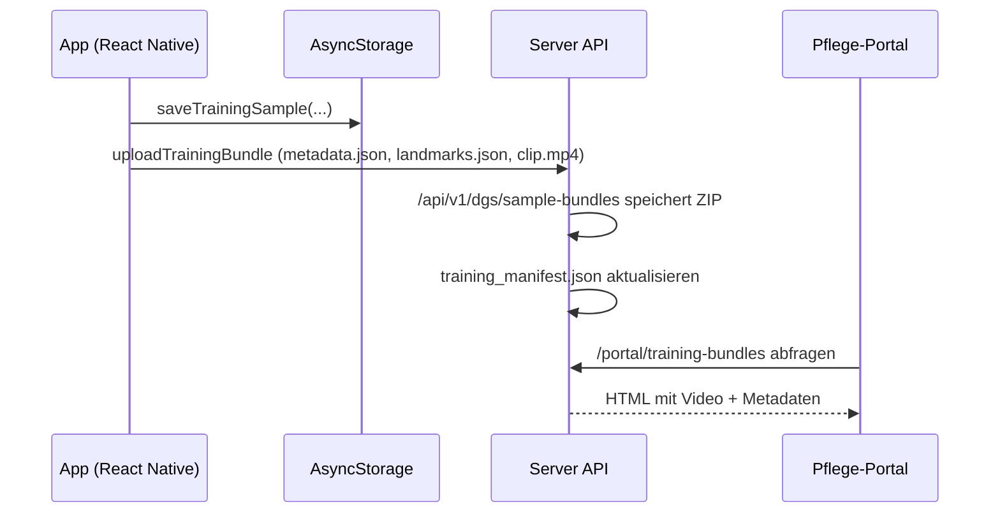

# Trainingspaket-Flow

Diese Notiz dokumentiert den Weg eines neuen Gestensamples von der App bis zur Moderation im Portal.

## Wichtige Implementierungsstellen

- `app/src/services/trainingBundleService.ts` – baut und lädt das ZIP mit Landmark-Timeline und Videoclip.
- `server/src/routes/trainingBundleRoute.ts` – validiert und entpackt Trainingspakete, legt sie unter `data/uploads/` ab und erweitert das Manifest.
- `server/src/portal/index.ts` – rendert eine Pflegekraft-Ansicht mit allen Bundles, Videoplayern und JSON-Metadaten.

## Manuelle QA-Checkliste

1. **Gestenaufnahme starten** – In der App auf der Trainingsseite eine Geste aufzeichnen und bestätigen.
2. **Bundle-Upload beobachten** – Sicherstellen, dass `uploadTrainingBundle` eine `queued`-Antwort vom Server erhält (Debug-Log `trainingBundleService`).
3. **Moderationsportal prüfen** – `/portal/training-bundles` öffnen und nach der neuen Bundle-ID suchen.
4. **Videoclip abspielen** – Im Portal den eingebetteten Player starten und prüfen, dass der Clip wiedergegeben wird.
5. **Metadaten kontrollieren** – Auf "Metadaten als JSON" klicken und Label, Profil-ID sowie Zeitstempel überprüfen.
6. **Manifest-Datei inspizieren** – `data/datasets/training_manifest.json` kontrollieren: neuer Eintrag mit korrekten Dateipfaden?

Die Schritte 3–6 stellen sicher, dass Pflegekräfte jedes Paket freigeben können, bevor es in das Training einfließt.
