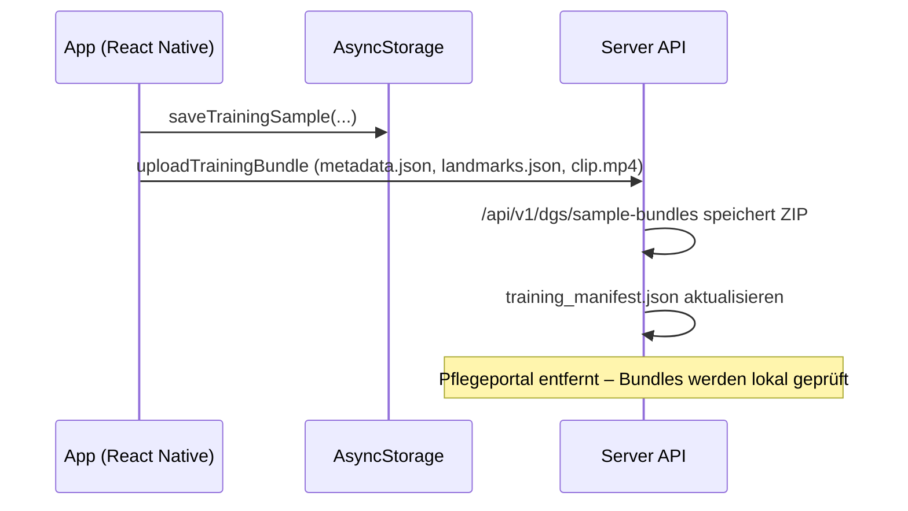

# Trainingspaket-Flow

Diese Notiz dokumentiert den Weg eines neuen Gestensamples von der App bis zum Server. Die frühere Pflegekraft-Moderation im Portal wurde eingestellt; Bundles werden nun direkt über Dateien geprüft.

## Wichtige Implementierungsstellen

- `app/src/services/trainingBundleService.ts` – baut und lädt das ZIP mit Landmark-Timeline und Videoclip.
- `server/src/routes/trainingBundleRoute.ts` – validiert und entpackt Trainingspakete, stellt sicher, dass `landmarks.json` vorhanden ist und mindestens einen Frame enthält, räumt fehlerhafte Extraktionen wieder auf und erweitert das Manifest inklusive `metadata.validationSummary` (Frame-Anzahl + Pfad).
- `server/src/services/trainingBundleIngestor.ts` – liest exakt den in `metadata.validationSummary.landmarksPath` hinterlegten Pfad aus dem Manifest, extrahiert nur diesen geprüften `landmarks.json`-Inhalt und schreibt jeden Frame mitsamt `profileId` in `data/dgs_samples.json`, damit kein Kind versehentlich das Modell eines anderen beeinflusst.
- `server/src/amyserver_tools/train_mlp.py` – greift auf denselben Pfad zurück, filtert Samples pro Profil und erzeugt daraus globale sowie personalisierte `.npz`-Modelle.
- Das ehemalige Portal (`server/src/portal/index.ts`) wurde entfernt. Pflegekräfte prüfen Bundles direkt anhand der abgelegten Dateien.

## Manuelle QA-Checkliste

1. **Gestenaufnahme starten** – In der App auf der Trainingsseite eine Geste aufzeichnen und bestätigen.
2. **Bundle-Upload beobachten** – Sicherstellen, dass `uploadTrainingBundle` eine `queued`-Antwort vom Server erhält (Debug-Log `trainingBundleService`).
3. **Bundle-Dateien prüfen** – Im Verzeichnis `data/uploads/<profil>/` sicherstellen, dass `bundle.zip` und extrahierte Assets vorliegen.
4. **Videoclip abspielen** – Den abgelegten Clip (`*.mp4`) lokal öffnen und prüfen, dass die Aufnahme vollständig ist.
5. **Landmarks-Datei validieren** – `landmarks.json` öffnen, JSON parse (mindestens ein Frame vorhanden) und bestätigen, dass die Daten mit den Logs übereinstimmen.
6. **Manifest-Datei inspizieren** – `data/datasets/training_manifest.json` kontrollieren: neuer Eintrag mit korrekten Dateipfaden und aktualisiertem `metadata.validationSummary`?
7. **Profil-Zuordnung bestätigen** – In `data/dgs_samples.json` prüfen, dass jede neue Probe `profileId` gesetzt hat und der `validationSummary.landmarksPath` aus dem Manifest auf die tatsächlich trainierte Datei zeigt.

Die Schritte 3–7 stellen sicher, dass jedes Paket vollständig vorliegt, bevor es in das Training einfließt.
