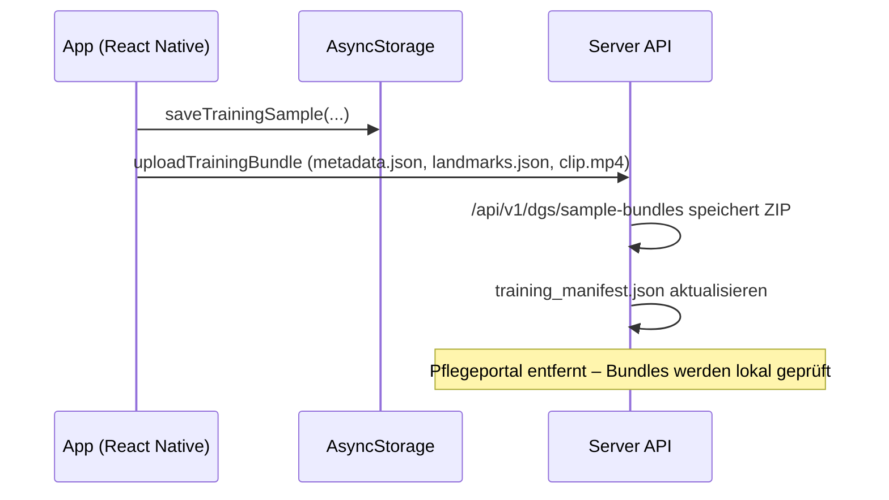

# Trainingspaket-Flow

Diese Notiz dokumentiert den Weg eines neuen Gestensamples von der App bis zum Server. Die frühere Pflegekraft-Moderation im Portal wurde eingestellt; Bundles werden nun direkt über Dateien geprüft.

## Wichtige Implementierungsstellen

- `app/src/services/trainingBundleService.ts` – baut und lädt das ZIP mit Landmark-Timeline und Videoclip.
- `server/src/routes/trainingBundleRoute.ts` – validiert und entpackt Trainingspakete, legt sie unter `data/uploads/` ab und erweitert das Manifest.
- Das ehemalige Portal (`server/src/portal/index.ts`) wurde entfernt. Pflegekräfte prüfen Bundles direkt anhand der abgelegten Dateien.

## Manuelle QA-Checkliste

1. **Gestenaufnahme starten** – In der App auf der Trainingsseite eine Geste aufzeichnen und bestätigen.
2. **Bundle-Upload beobachten** – Sicherstellen, dass `uploadTrainingBundle` eine `queued`-Antwort vom Server erhält (Debug-Log `trainingBundleService`).
3. **Bundle-Dateien prüfen** – Im Verzeichnis `data/uploads/<profil>/` sicherstellen, dass `bundle.zip` und extrahierte Assets vorliegen.
4. **Videoclip abspielen** – Den abgelegten Clip (`*.mp4`) lokal öffnen und prüfen, dass die Aufnahme vollständig ist.
5. **Manifest-Datei inspizieren** – `data/datasets/training_manifest.json` kontrollieren: neuer Eintrag mit korrekten Dateipfaden?

Die Schritte 3–5 stellen sicher, dass jedes Paket vollständig vorliegt, bevor es in das Training einfließt.
